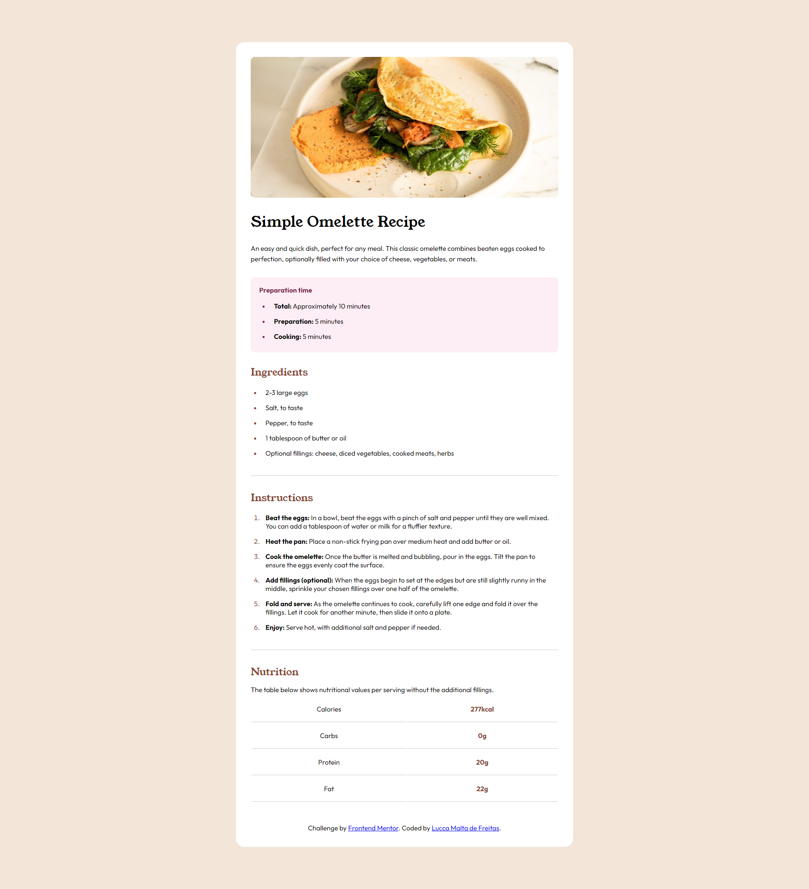

# Frontend Mentor - Recipe page solution

This is a solution to the [Recipe page challenge on Frontend Mentor](https://www.frontendmentor.io/challenges/recipe-page-KiTsR8QQKm).

## Table of contents

- [Overview](#overview)
  - [The challenge](#the-challenge)
  - [Screenshot](#screenshot)
  - [Links](#links)
- [My process](#my-process)
  - [Built with](#built-with)
  - [What I learned](#what-i-learned)
  - [Useful resources](#useful-resources)
- [Author](#author)

## Overview

### Screenshot



### Links

- Solution URL: (https://luccamf.github.io/Recipe-challenge/)

## My process

### Built with

- Semantic HTML5 markup
- CSS custom properties
- Mobile-first workflow

### What I learned

Use this section to recap over some of your major learnings while working through this project. Writing these out and providing code samples of areas you want to highlight is a great way to reinforce your own knowledge.

To see how you can add code snippets, see below:

```css
table {
    border-collapse: separate;
    width: 100%;
}
td {
    padding: 20px;
    text-align: center;
    border-bottom: 1px hsla(0, 0%, 0%, 0.2) solid;
}
```

### Useful resources

- [Table Style](https://www.w3schools.com/css/css_table_style.asp) - This helped me to style the table. I really liked this pattern and it fit what I needed.
- [Markdown Guide](https://www.markdownguide.org/) - This helped me to organize and style the README.md.

## Author

- LinkedIn - [Lucca Malta de Fretias](https://www.linkedin.com/in/luccamf/)
